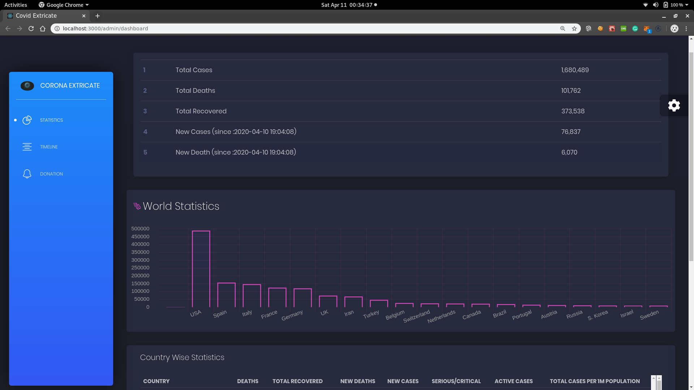
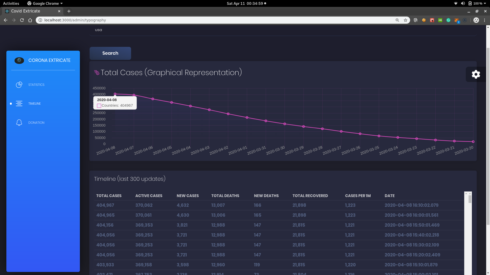
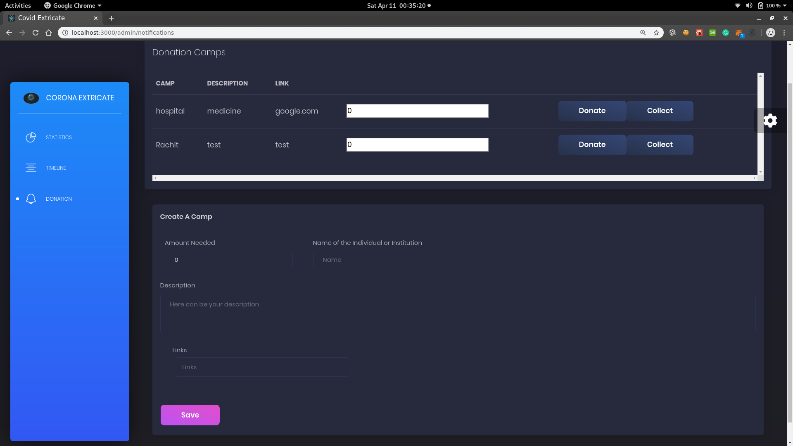

#                                              Covid-Extricate
####                                 A decentralized solution to Covid19


**Video Walkthrough:** [▶️ Youtube Link](https://youtu.be/PIdcg4L6Dgo)

**Live Demo:** [Link](https://covidextricate.herokuapp.com)

##  Installation
```
1. Clone the Repository.
2. npm i
   - npm start

```  
## About This Project
This project aims to ease the day-to-day life of people, doctors, and institutions.
1. All latest updates regarding the pandemic in one place.
2. Need for money? Raise a **Donation camp**.
3. **Report Lockdown Violation:** Take picture and report a lockdown violation committed by someone nearby you, in order to help create the better discipline to control the spread of the disease.

## Technology Used
* ReactJS
* NodeJS
* GraphQL
* Solidity Smart Contracts
* Web3

## Screenshots

* Report Lockdown Violation anonymously and in a Decentralized fashion.


* Get live statistics about corona virus.




* Get timeline of a particular country tot observe the spread rate.




* Need of money due to the pandamic? Create a donation camp describing your need and providing links to required  documents to proov the docs legit.


